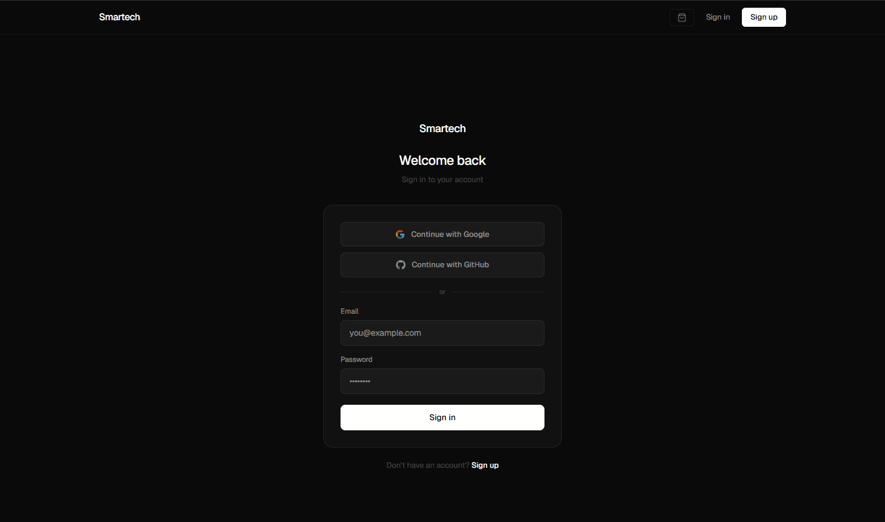

# Smartech

A full-stack e-commerce application built with Next.js 14, Supabase, and Stripe. Designed as a portfolio project demonstrating production-level patterns including real-time stock management, role-based access control, and secure payment processing.

**Live demo:** [smartech-one.vercel.app](https://smartech-one.vercel.app)

---

## Preview

> Add a screenshot or GIF of the project here.
> 

---

## Features

### Storefront
- Product catalog with sidebar filters — search, category, sort, and price range
- Responsive design — sidebar on desktop, bottom drawer on mobile
- Product detail pages with image, stock status, and related products
- Skeleton loading states and global navigation spinner

### Authentication
- Email/password registration and login
- OAuth with Google and GitHub
- Protected routes via Next.js middleware
- Session management with Supabase SSR

### Cart & Checkout
- Persistent cart with Zustand and localStorage
- Cart drawer with smooth animations
- Real payment processing with Stripe Checkout
- Idempotent webhook handling — duplicate events are safely ignored
- Atomic stock decrement via PostgreSQL function after successful payment
- Stock validation before checkout — prevents overselling

### User Dashboard
- Order history with status tracking
- Wishlist management
- Profile editing

### Reviews
- Star ratings with comment support
- Only verified buyers (users who purchased the product) can leave reviews

### Admin Panel
- Product CRUD with image uploads via Supabase Storage
- Order management with real-time status updates
- User overview with role management

---

## Tech Stack

| Technology | Purpose |
|---|---|
| Next.js 14 (App Router) | Framework — Server Components, Server Actions, file-based routing |
| TypeScript | Type safety across the entire codebase |
| Tailwind CSS + inline styles | Styling — dark design system with CSS variables |
| Supabase | PostgreSQL database, authentication, storage, and RLS policies |
| Stripe | Payment processing and webhook handling |
| Zustand | Client-side state management for cart and UI |
| Vercel | Deployment and edge functions |
| Lucide React | Icon library |
| Sonner | Toast notifications |

---

## Architecture decisions

### Role-based access control
User roles (`customer` / `admin`) are stored in the `profiles` table and enforced at the database level via Supabase Row Level Security policies. A `security definer` PostgreSQL function handles role checks without triggering infinite recursion in RLS policies.

The middleware only verifies session existence. Role verification happens inside each protected page via a `requireAdmin()` server function — this avoids a database query on every single request.

### Idempotent webhook
Stripe can deliver the same webhook event multiple times. The webhook handler checks for a `23505` duplicate key error on the `stripe_session_id` unique constraint instead of using a pre-check SELECT. This eliminates the race condition that would occur if multiple webhook calls arrived simultaneously.

### Atomic stock management
Stock decrements use a PostgreSQL function with `security definer` that runs as a single atomic operation:

```sql
update products
set stock = stock - quantity
where id = product_id
and stock >= quantity;
```

The `and stock >= quantity` guard prevents negative stock even under concurrent purchases. If stock is insufficient, the function raises an exception that is caught and logged without failing the webhook — the payment is already confirmed and cannot be reversed.

### Supabase SSR
Two separate Supabase clients are used — a browser client for Client Components and a server client for Server Components and Route Handlers. This is required by Next.js App Router because cookie handling differs between server and client contexts. A third admin client with the `service_role` key is used only in webhook handlers and server-side admin operations.

### Cart architecture
The cart drawer is mounted at the root layout level rather than inside the Navbar. This prevents `position: fixed` elements from losing their positioning context when a parent has `transform` or `overflow` applied — a common source of z-index and layout bugs in Next.js applications.

---

## Getting started

### Prerequisites
- Node.js 18+
- A [Supabase](https://supabase.com) account
- A [Stripe](https://stripe.com) account
- The [Stripe CLI](https://stripe.com/docs/stripe-cli) for local webhook testing

### 1. Clone the repository

```bash
git clone https://github.com/your-username/smartech.git
cd smartech
```

### 2. Install dependencies

```bash
npm install
```

### 3. Set up Supabase

Create a new Supabase project and run the SQL scripts in order:

1. Create tables (`categories`, `products`, `profiles`, `orders`, `order_items`, `wishlists`, `reviews`)
2. Enable Row Level Security on all tables
3. Create the `get_user_role` security definer function
4. Create RLS policies for each table
5. Create the `decrement_stock` function
6. Create the `on_auth_user_created` trigger

> The full SQL is available in `/supabase/schema.sql` (add your schema file here).

### 4. Set up environment variables

Create a `.env.local` file in the root:

```bash
# Supabase
NEXT_PUBLIC_SUPABASE_URL=https://your-project.supabase.co
NEXT_PUBLIC_SUPABASE_ANON_KEY=your-anon-key
SUPABASE_SERVICE_ROLE_KEY=your-service-role-key

# Stripe
NEXT_PUBLIC_STRIPE_PUBLISHABLE_KEY=pk_test_...
STRIPE_SECRET_KEY=sk_test_...
STRIPE_WEBHOOK_SECRET=whsec_...

# App
NEXT_PUBLIC_APP_URL=http://localhost:3000
```

### 5. Set up OAuth (optional)

- **Google:** Create a project in [Google Cloud Console](https://console.cloud.google.com), configure an OAuth consent screen, and create OAuth credentials. Add `https://your-project.supabase.co/auth/v1/callback` as an authorized redirect URI.
- **GitHub:** Create an OAuth App in [GitHub Developer Settings](https://github.com/settings/developers). Set the callback URL to `https://your-project.supabase.co/auth/v1/callback`.

Enable both providers in Supabase → Authentication → Providers.

### 6. Run the development server

```bash
# Terminal 1 — Next.js
npm run dev

# Terminal 2 — Stripe webhook forwarding
stripe listen --forward-to localhost:3000/api/stripe/webhook
```

Copy the webhook signing secret from the Stripe CLI output and update `STRIPE_WEBHOOK_SECRET` in `.env.local`.

Open [http://localhost:3000](http://localhost:3000).

### 7. Create an admin user

Register a new account, then run this SQL in the Supabase SQL Editor:

```sql
update profiles
set role = 'admin'
where id = (select id from auth.users where email = 'your@email.com');
```

Access the admin panel at `/admin`.

### 8. Test payments

Use Stripe's test card:

```
Number:  4242 4242 4242 4242
Expiry:  Any future date
CVC:     Any 3 digits
```

---

## Environment variables reference

| Variable | Required | Description |
|---|---|---|
| `NEXT_PUBLIC_SUPABASE_URL` | ✅ | Your Supabase project URL |
| `NEXT_PUBLIC_SUPABASE_ANON_KEY` | ✅ | Supabase anonymous key (public) |
| `SUPABASE_SERVICE_ROLE_KEY` | ✅ | Supabase service role key (server only) |
| `NEXT_PUBLIC_STRIPE_PUBLISHABLE_KEY` | ✅ | Stripe publishable key (public) |
| `STRIPE_SECRET_KEY` | ✅ | Stripe secret key (server only) |
| `STRIPE_WEBHOOK_SECRET` | ✅ | Stripe webhook signing secret |
| `NEXT_PUBLIC_APP_URL` | ✅ | Base URL of the app (no trailing slash) |

---

## Project structure

```
src/
├── app/
│   ├── (auth)/          # Login and register pages
│   ├── (store)/         # Catalog and product detail pages
│   ├── admin/           # Admin panel (role-protected)
│   ├── api/             # Route handlers (Stripe webhook, checkout session)
│   ├── checkout/        # Checkout and success pages
│   └── dashboard/       # User dashboard (orders, wishlist, profile)
├── components/
│   ├── admin/           # Admin-specific components
│   ├── auth/            # OAuth buttons
│   ├── cart/            # Cart drawer and items
│   ├── dashboard/       # Profile form, wishlist button
│   ├── layout/          # Navbar, Hero, UserMenu, LogoutButton
│   ├── products/        # ProductCard, ProductGrid, FilterSidebar, Reviews
│   └── ui/              # Skeleton, LoadingSpinner
├── lib/
│   ├── hooks/           # useFilters
│   ├── store/           # Zustand stores (cart, cart drawer, loading)
│   ├── supabase/        # Client, server, admin clients, actions, auth helpers
│   ├── stripe/          # Stripe client
│   └── utils/           # formatPrice
└── types/               # TypeScript types
```

---

## Roadmap

- [ ] Cart synced to Supabase — multidevice persistence
- [ ] Supabase Storage for product images (migration from Cloudinary-ready architecture)
- [ ] Discount codes via Stripe Coupons
- [ ] Order status email notifications
- [ ] Admin analytics dashboard with revenue charts
- [ ] Product image gallery (multiple images per product)

---

## License

MIT
